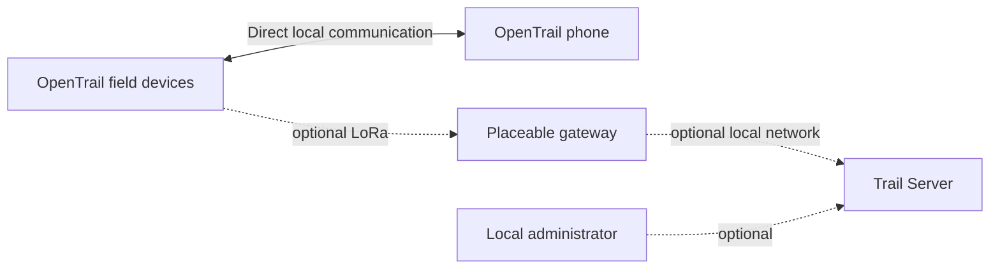

# Limited Underground Trail Server

Trail Server is an optional companion to the offline-first OpenTrail field
system. It is intended to add local persistence, administration, and gateway
services for larger installations while keeping the core field path usable
without a server or internet connection.

The project is under active private development. This repository is its public
engineering record: it explains the direction, milestones, current maturity,
and remaining work without publishing private source code or operational
details.

## Where the project stands

As of September 18, 2026:

- the initial server architecture and a reproducible Linux host baseline have
  been exercised;
- service, persistence, backup/restore, and local administration foundations
  have passed bounded development checks;
- versioned local-radio and authenticated Wi-Fi gateway interfaces have passed
  deterministic host tests;
- an ELECROW ThinkNode G3 candidate has been physically identified and used for
  recoverable diagnostic firmware trials; and
- live LoRa receive/transmit behavior, supported device firmware, completed LAN
  security, deployment, and field acceptance remain open work.

See [Status](STATUS.md) for the evidence level behind each statement and
[Project history](HISTORY.md) for the dated record from project start.

## System outline

The solid path is the independent field path. Every server-side component is
optional. A server, gateway, or internet failure must not prevent supported
local field operation.

## Public project record

- [History](HISTORY.md) — dated milestones from August 2026 onward
- [Status](STATUS.md) — current capabilities and evidence maturity
- [Roadmap](ROADMAP.md) — completed foundations and remaining work
- [Architecture](docs/ARCHITECTURE.md) — public system boundaries
- [Hardware](docs/HARDWARE.md) — verified candidate information and unknowns
- [Security and privacy](docs/SECURITY-AND-PRIVACY.md) — public principles

Project page: [limitedunderground.com/projects/trail-server](https://limitedunderground.com/projects/trail-server)

## Source availability

Current Trail Server source code, firmware, tests, infrastructure, and detailed
engineering evidence are private. This repository contains progress information
only. Historical source versions that were previously published retain the
licenses attached to those versions.

Nothing here claims production, deployment, field, safety, availability, or
delivery readiness.
