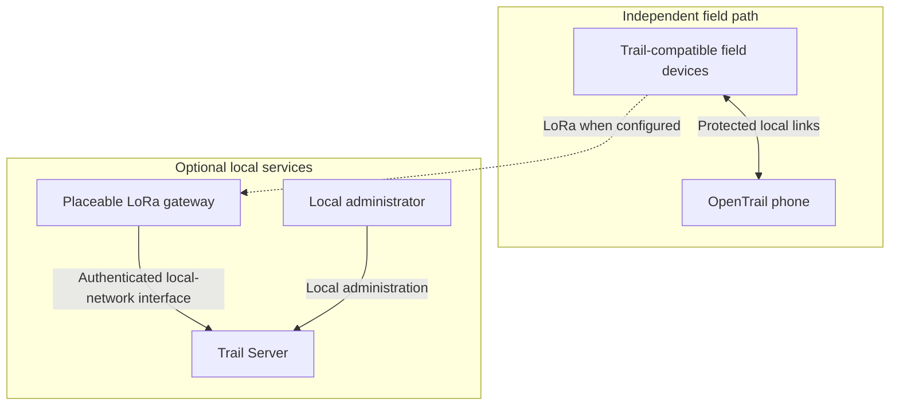

# Public architecture overview

Trail Server extends an offline-first field system without becoming a dependency
of that system.

## Boundaries

- **OpenTrail field operation remains independent.** Supported direct local
  operation does not require Trail Server, a gateway, or internet access.
- **The gateway is a bounded bridge.** It connects compatible radio traffic to
  authenticated local server services. It is not the authority for field-device
  identity or safety.
- **The server owns durable server records.** A durable server receipt occurs
  only after durable storage. A radio transmission is not proof that a field
  device received a message.
- **Interfaces are versioned and minimized.** Compatibility, authentication,
  consent, retention, and deletion behavior must be explicit before acceptance.
- **Evidence advances in stages.** Host simulation, device diagnostics, live RF,
  field trials, and production operations are separate acceptance layers.

Detailed protocols, deployment topology, network settings, credentials, and
implementation source are intentionally outside this public record.
